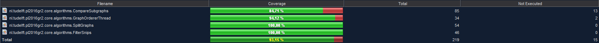
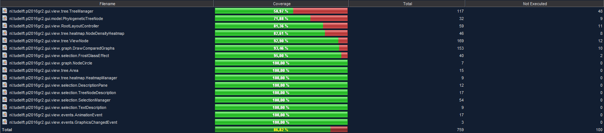
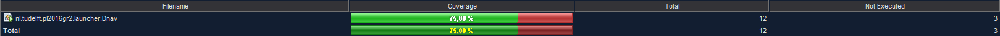
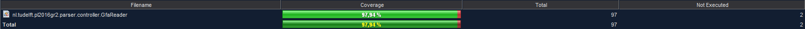
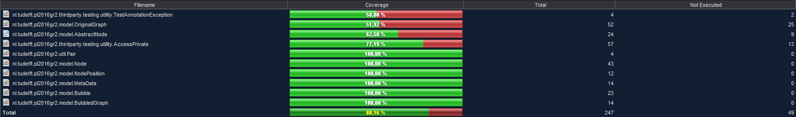
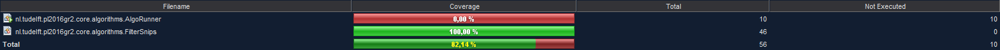
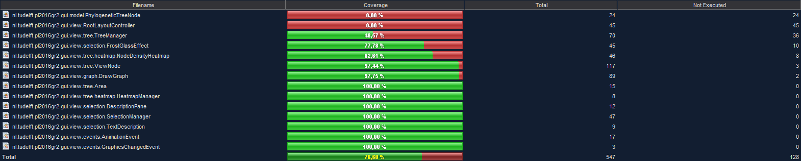
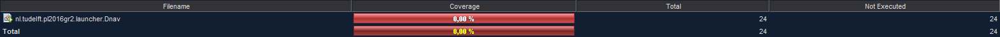
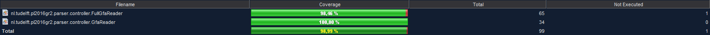
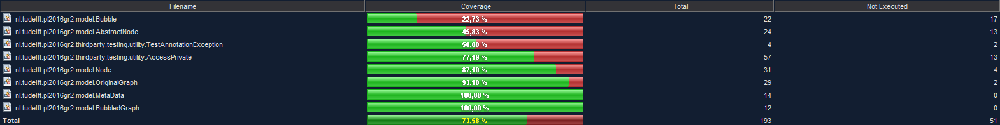

Testing Document
===================
This testing document will describe everything about our tests. It will describe which classes are and are not well tested and all of the special cases. Special cases include:

- Untested code and the reason why we haven't tested this code
- How we have manually tested pieces of code, such as parts of the user interface and why we didn't make automated test for these parts of code
- Exceptionally well tested code
- Uncommon/unique ways of testing

### Organisation of the testing document
This testing document will discuss the code coverage and special cases based on the modules. At the end of the document there will be a code coverage overview per sprint (percentage of lines covered per class per module). To get a better understanding of each module we will discuss the role of each module here.

##### Core
The core module contains the code which performs the core activities of the application. Currently this only includes all of the algorithms used to process the data.

##### Gui
The gui module contains the code which manages the user interface. This includes the layout of the user interface, the interactions between the user and the application and visualizing the data which has been requested by the user.

##### Launcher
The launcher module contains the code to launc the application. This module contains the main function and only calls the methods which are necessary to initialize (launch) the application.

##### Parser
The parser module contains the code which parses all of the external file formats which are needed and turns them into objects.

##### Shared
The shared module contains all of the code which is used by multiple modules. This includes things like interfaces and utility classes.

Code Coverage
===================
In this chapter we will discuss the code coverage of each module separately.

### Core

The core module is almost fully tested (everything above 80%).

### Gui

The most important components of the GUI module are covered. See the special cases section for missing coverage.

### Launcher

Currently the launcher module decently tested (see special cases).

### Parser

The parser is fully tested.

### Shared

Most of the shared module classes are tested. Only the OriginalGraph and AbstractNode classes require considerable more coverage. We plan to refactor a large part of the shared module, so we have delayed testing more rigorously till this is completed (which will be next sprint; sprint 5). The TestAnnotationException and AccessPrivate classes are not part of our project (they are third party classes), so please don't consider these classes. They are not removed from the image to make sure the total coverage adds up. We will try to remove them from the coverage reports as soon as possible.

Special Cases
===================
In this chapter we will discuss the special cases of each module separately.
### Core
None.

### Gui
The gui is currently only unit tested. Soon we will also include integration tests.
Some parts of the gui module are very hard to test using automated tests and very easy to test manually. An example of this would be animations. For this reason we will not test some parts of the GUI module. All of the parts which we are not going to test for this reason are listed below, including the reason why these parts are not reasonable to test automatically and how these parts can be tested manually.

- Class: <code>NodeDensityHeatmap</code>
  - Method: <code>addAnimationEventHandler</code>
  - Reason: This method handles the animation of the heatmap parts when zooming in or out. We don't test annimations because they only change the position of objects and it is very hard to verify the correct object position automatically.
  - How to test: Launch the application and zoom in or out on child nodes of the phylogenetic tree by scrolling while hovering over them (or to the right of them.). While zooming in the heatmap (located at the right of the tree) will be animated, matching the animation of the tree nodes.
- Class: <code>FrostGlassEffect</code>
  - Reason: This class is used to create a visual effect: to blur the content behind the pane to which the effect is applied to create a frost glass effect. It is not possible to verify the correct behavior of this class, because the performed actions are purely based on image manipulation (using gaussian blurs).
  - How to test: Launch the application and select a node in the phylogenetic tree by clicking on it. A window containing information about the clicked node will pop up and the background of the window will contain a frost glass effect.
- Class: <code>TreeManager</code>
  - Methods: <code>initializeZoomOutEventHandler</code>, <code>initializeZoomEventHandler</code>, <code>zoomIn</code>, <code>zoomOut</code>, <code>initializeGraphSizeListeners</code>
  - Reason: All of these methods are used to zoom in or out on the phylogenetic tree, or adjust the size of the phylogenetic tree when the window is resized. Zooming in and out is based on animations and thus not reasonably possible to test.
  - How to test: Launch the application and zoom in or out on child nodes of the phylogenetic tree by scrolling while hovering over them (or to the right of them.).

### Launcher
Currently the launcher module is not tested. The reason for this is that the launcher module doesn't implement any new functionality, since it only initializes other parts of the application. This module can thus not be unit tested. The actions performed by the launcher module will be tested using intergration tests in the other modules (in the near future), so there is no need to test this behavior again in the launcher module.

### Parser
None.

### Shared
The shared package contains a few classes which implement unique testing behavior, so this will be discussed here. These classes are present in the <code>nl.tudelft.pl2016gr2.thirdpart.testing.utility</code> package. These classes can be used to annotate a private field or method of a class with a <code>@TestId</code> tag and retrieve the value of the field, or call the method in the test class. This way we will not have to make getters and setters which are only used by the test classes and we can call private methods from within the test classes without having to make them visible to classes in the source code. The functionality of the methods in this package is based on reflection and is only intended to be used by test classes. See the test classes of these utility classes for usage examples.

Coverage per sprint
====================
In this section we will include the code coverage reports of each sprint, from sprint 3 onwards. The shown percentage represents the line coverage and the total amount of lines and amount of missed lines are also shown.

### Sprint 3
These are the coverage reports of the dev branch at the end of sprint 3.

###### Core module

###### GUI module

###### Launcher module

###### Parser module

###### Shared module

### Sprint 4
These are the coverage reports of the dev branch at the end of sprint 4.

###### Core module

###### GUI module

###### Launcher module

###### Parser module

###### Shared module

> last updated at 20/5/2016 (end of sprint 4)